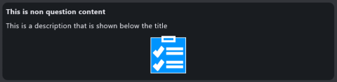
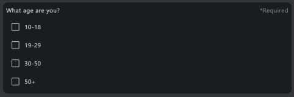
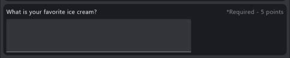
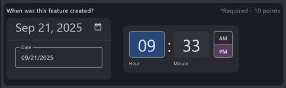
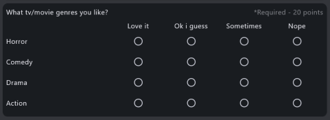
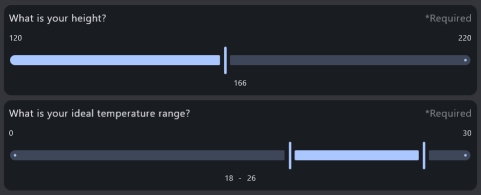

# Survey Tool - User Guide

A complete guide for using the Survey Tool to create and run surveys or quizzes. This targets the usage of the tool, not the development.

## Table of Contents

- [Getting Started](#getting-started)
- [Running a Survey](#running-a-survey)
- [Using the Command Line](#cmd-line-usage)
- [Survey vs Quiz Mode](#survey-vs-quiz-mode)
- [Create your own survey](#create-your-own-survey)
- [Results](#results)
- [Understanding Content Types](#understanding-content-types)
- [Leaderboard](#leaderboard)
- [Frequently Asked Questions](#frequently-asked-questions)
- [Getting Help](#getting-help)
- [Tips for Best Survey Experience](#tips-for-best-survey-experience)

---

## Getting Started

### System Requirements

- Windows or Linux desktop computer
- Java Runtime Environment (JRE) 21 or higher

### Run the app

1. Download the Survey Tool jar for your operating system (https://github.com/HuppiFluppi/survey-tool/releases/latest)
2. Run the downloaded jar (e.g. by double-click)

---

## Running a Survey

### Step 1: Launch the Application

Start the Survey Tool application. You'll see the main screen with option to load a survey.

### Step 2: Load a Survey Configuration

Click the "Load Survey" button and select a survey configuration file (`.yaml` file). Alternatively, you can drag and drop a file into the app. 
See [Create your own survey](#create-your-own-survey) for how to create a configuration file.

> **Note:** Information from the survey configuration file is used to display the survey to the user. 
> For this, the survey can also define files to load as image from the users computer. 
> While misuse is unlikely and the referenced images are not sent or captured, dont load suspicious surveys. 

### Step 3: Review Survey Information

After loading, you'll see the survey summary screen showing:
- Survey title and description
- Number of pages
- Type (Survey or Quiz)
- Leaderboard (if it's a quiz)

### Step 4: Start the Survey

Click "Start Survey" to begin. You'll be guided through each page of questions.

### Step 5: Answer Questions

- Answer each question as prompted
- Required questions are marked and must be answered before proceeding
- Optional questions can be skipped
- Use the "Next" button to move to the next page
- Use the "Cancel" button to return to the summary screen at any time. This discards all entries of current run.

### Step 6: Submit

After completing all pages, review your answers and click "Submit" to finish.

You will be brought back to the summary screen from the beginning.
For **Quizzes**, you'll see your score and ranking on the leaderboard (if enabled)

---

## Cmd line Usage

The tool can be started with command line arguments to directly load a survey configuration. 
This skips the loading screen and might be useful in automated setups. 
Run the jar (self build or downloaded from release) in your local cmd line:

`> java -jar survey-tool.jar <path-to-config>`

For more information about command line usage and available options, run `java -jar survey-tool.jar -h`

---

## Survey vs Quiz Mode

Survey Tool operates in two modes. For simplicity, the documentation always speaks of survey.

### Survey Mode

- **Purpose**: Collect opinions, feedback, or information
- **Scoring**: No scoring
- **Leaderboard**: Not available
- **Use cases**: Customer satisfaction, research studies, feedback forms

### Quiz Mode

- **Purpose**: Test knowledge with correct/incorrect answers
- **Scoring**: Points awarded for correct answers
- **Leaderboard**: Shows top scorers (optional)
- **Question scores**: May be displayed on each question
- **Use cases**: Trivia games, knowledge tests, training assessments

---

## Create your own survey

The `template.yaml` can serve as a blueprint for your own configuration file. It lists and explains all available options.
Several example surveys can be found in the `examples` folder:

- **customer-satisfaction-survey.yaml** - A typical customer feedback survey
- **trivia-quiz.yaml** - A general knowledge quiz with scoring
- **minimal-all-question-types-survey.yaml** - Demonstrates all available question types

It is suggested to use one of the examples as base and alter it according to your needs. 
To help with the formatting, use an editor with yaml support (e.g. Visual Studio Code with Red Hat `YAML` plugin).

Configuration requirements:
- Must consist of exactly one survey header and it must be the first document (separated by `---`) in the file
- Must have at least one survey page with at least one question
- The elements in the configuration yaml must have all required fields

### Schema files

Two schema files exist to help you write and check your created configuration file. You dont have to use any of the schema files to write the configuration file.
How to set up your editor to take the schema into account varies (for the Visual Studio Code Yaml plugin, one can add `# yaml-language-server: $schema=<urlToTheSchema>` to the file).

Please be aware that as of this writing, the autocomplete and schema checking inside different tools is not working great. 
The configuration file consist of multiple yaml documents (separated by `---`) and the schema checkers really don't like that.

Schema files:
- [survey_schema.json](files/survey_schema.json): This schema uses `anyOf` to handle multiple documents. It seems to yield better results in most editors
- [survey_schema2.json](files/survey_schema2.json): This schema uses `arrays` to handle multiple documents. Probably the *correct* way but doesn't seem to be supported by editors.

Choose the schema that works best in your editor (or none at all).

> Note: survey_schema2.json is currently unmaintained. Majority of tools and libs show better results with the other approach.

---

## Results

Survey Tool automatically writes and updates results after each submit. Two files are created. The name always uses the filename of the loaded configuration file without extension:
- **<survey_config_file>_summary**: Holds summary information about the survey.
- **<survey_config_file>_data**: Holds information of every single survey run. Each entry has all questions and answers from one take of the survey.

Please keep in mind that the result filenames are based on the survey configuration filename. Changes in the configuration filename will result in changes in the result filenames.

---

## Understanding Content Types

Survey Tool supports seven different content types. Check `template.yaml` for detailed information about how they can be configured. 
Each serves a specific purpose:

### 1. Data Question

**Purpose**: Collect participant information like name, email, or phone number.

**How to use**:
- Enter your information in the text field
- The field validates your input based on the data type (e.g., email format)
- Common uses: Name, nickname, email address, phone number, age, birthday or custom text

**Example**: "What is your name?"

---

### 2. Information Block

**Purpose**: Display information to participants without requiring an answer.

**How to use**:
- Show the information given
- No action required - this is not a question
- May include text, descriptions, and images

**Example**: "The following questions will be about astronomy"

---

### 3. Choice Question

**Purpose**: Select one or multiple options from a list.

**How to use**:
- **Single choice**: Click one option (radio buttons or dropdown)
- **Multiple choice**: Check multiple boxes (limited by maximum selections if specified)
- **Dropdown**: For a compact view, choose dropdown to show options (single choice)
- **Horizontal**: Another compact view option. Shows the answers in a horizontal line (single choice). 
- Selected options are highlighted
- Check on the best option for choice representation, long options might not be suitable for dropdown or horizontal.

**Example**: 
- "What is your favorite color?" (single choice)
- "Which programming languages do you know?" (multiple choice)

---

### 4. Text Question

**Purpose**: Provide free-form text answers.

**How to use**:
- **Single line**: Type a short answer in the text field
- **Multi-line**: Type longer responses in the text area
- No character limit
- Can be used for open-ended feedback
- Can be validated(scored) based on direct match, list of correct answers and answer pattern

**Example**: 
- "What is your favorite ice cream flavor?" (short answer)
- "Please describe your experience with our product" (long answer)

---

### 5. Date/Time Question

**Purpose**: Select a specific date, time, or both.

**How to use**:
- **Date only**: Use the date picker to select a date
- **Time only**: Use the time picker to select a time
- **Date and time**: Select both date and time
- Initial values may be pre-selected
- Click the picker icon to open the selection interface
- If an initial time or date is set and the user doesnt change, the initial set is taken as answer

**Example**: 
- "When is your birthday?" (date)
- "What time do you prefer for meetings?" (time)
- "When did the incident occur?" (date and time)

---

### 6. Rating Question

**Purpose**: Rate something on a visual scale.

**How to use**:
- Click on the rating symbols to select your rating
- Ratings typically range from 1 to 10 (most common: 1-5)
- Different symbols may be used: stars ⭐, hearts ❤️, thumbs up 👍, smileys 😊 or numbers #️⃣
- Icons can have different colors (e.g., red to green gradient)
- Click a symbol to select that rating level

**Example**: "How satisfied are you with our service?" (1-5 stars)

---

### 7. Likert Scale Question

**Purpose**: Rate multiple statements using the same scale (Matrix).

**How to use**:
- You'll see a grid with statements (rows) and rating options (columns)
- For each statement, select one option that best represents your opinion
- Common scales: "Strongly Disagree" to "Strongly Agree"
- If the question is required, each statement must be rated before proceeding

**Example**: 
"Rate your agreement with the following statements:"
- "The product is easy to use" → [Strongly Disagree | Disagree | Neutral | Agree | Strongly Agree]
- "The product is reliable" → [Strongly Disagree | Disagree | Neutral | Agree | Strongly Agree]
- "I would recommend this product" → [Strongly Disagree | Disagree | Neutral | Agree | Strongly Agree]

---

### 6. Slider Question

**Purpose**: Select an answer from a range of values.

**How to use**:
- **Normal**: Click on the slider to select your answer
- **Range**: If enabled, the user can make a selection with start and end (two values)
- Start and end of the slider can be configured
- Internally, floats are used and saved for answers
- However by default, decimal places are not shown
- This question type can be scores to either match (range: false) or be in range (range: true)

**Example**: "What is your height?"

---

## Leaderboard

In a quiz, the scoring and leaderboard can be enabled.
Points must be configured per question.
Questions and leaderboard can be configured to display scores.

### How It Works

1. Complete the quiz by answering all questions
2. The score is calculated based on correct answers
3. Participants name is taken from the first data field with type `name`
4. A ranking appears on the leaderboard, showing the highest scores

### Leaderboard Display

- Shows the top participants (typically top 10)
- Displays participant names and scores
- May show placeholder entries if not enough participants have completed the quiz

### Privacy Note

Only the name provided in the quiz is displayed on the leaderboard. No other personal information is collected.

---

## Frequently Asked Questions

### What happens if I close the application mid-survey?

Your progress will be lost. The tool doesn't support resuming survey runs.

### What happens with previous completed surveys if i close and reopen the app?

Survey Tool will attempt to load previous data according to the configuration filename. It then restores leaderboard and appends new data.

### Are answers saved?

Yes, answers are saved when the survey is submitted.

### Can I skip questions?

Only questions marked as optional can be skipped. Required questions must be answered before you can proceed.

### How long does a survey take?

This varies by survey. The survey summary page gives an indication by showing total number of pages and questions.

### What if I make a mistake?

You can change your answers on the current page and go back to edit previous answers.

### Can the same quiz be taken multiple times?

Yes, retake of quizzes is possible. Each attempt is recorded separately.

### Why can't I select more options in a multiple-choice question?

Some multiple-choice questions have a maximum selection limit. Check if you've reached the limit (e.g., "Select up to 2 options").

### What does the dropdown option mean for choice questions?

Instead of showing all choices as single entries, a dropdown presents choices in a compact menu. Click the dropdown to see and select options.

### How is the quiz score calculated?

Each question in a quiz has a point value. Points are earned for correct answers. Total score is the sum of all points earned.

### Can I see which answers were correct after submitting a quiz?

No.

### What file format does Survey Tool use?

Survey Tool uses YAML configuration files (`.yaml` extension). These are text files that define the survey structure and questions.
The result files are written in the CSV format.

### Can I create my own surveys?

Yes! While this guide focuses on using surveys, you can create your own by writing a YAML configuration file. See the `template.yaml` file and examples in the `examples` folder for guidance.

### The application won't start. What should I do?

Ensure you have Java Runtime Environment (JRE) 21 or higher installed. Check the system requirements and installation instructions.

### Can I use Survey Tool on mobile devices?

Currently, Survey Tool is designed for desktop computers only. Mobile support may be added in future versions.

### Is my data secure?

Survey Tool runs locally on your computer. Data is stored locally and is only accessible to the survey administrator who has access to the computer.

### Can I print my survey results?

The application doesn't have a built-in print feature. You may be able to take screenshots or ask the survey administrator for a results export.

### What languages does Survey Tool support?

The UI currently supports English and German.
The survey language depends on the survey configuration. The tool can display surveys in any language, as long as the configuration file is written in that language.

### Can I pause a survey and resume later?

No. This is currently not supported.

---

## Getting Help

If you encounter issues or have questions not covered in this guide:

1. Check the example surveys in the `examples` folder for reference
2. Review the `template.yaml` file for configuration details
3. Visit the project repository for technical documentation and support

---

## Tips for Best Survey Experience

- **Use a stable internet connection** if the survey loads remote content
- **Complete surveys in one session** to avoid losing progress
- **Read instructions carefully** before answering questions
- **Take your time** - there's usually no time limit
- **Be honest** in your responses for the most valuable feedback
- **Check your answers** on each page before clicking "Next"
